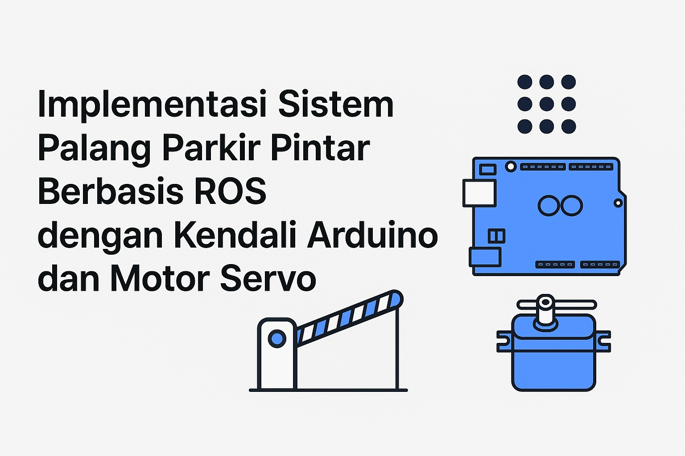

<!doctype html>
<html lang="id">
<head>
  <meta charset="utf-8" />
  <meta name="viewport" content="width=device-width,initial-scale=1" />
  <title>Implementasi Sistem Palang Parkir Pintar — ROS + Arduino + Servo</title>
  
</head>
<body>
  

    <header>
      
      <h1>🚧 Implementasi Sistem Palang Parkir Pintar Berbasis ROS dengan Kendali Arduino dan Motor Servo</h1>
      
<i>Project MK Robotika Medis</i>

    </header>

    

      
👥 Anggota Kelompok

      <table class="members">
        <thead>
          <tr><th>Nama</th><th>NIM</th></tr>
        </thead>
        <tbody>
          <tr><td>Aldrey Diriyah</td><td>122430054</td></tr>
          <tr><td>Affan Alfarabi</td><td>122430077</td></tr>
          <tr><td>Fadhlurrohman Arif</td><td>122430144</td></tr>
        </tbody>
      </table>
    

    

      

        
📘 Pendahuluan

        
Proyek ini merupakan implementasi sistem palang parkir pintar yang mengintegrasikan Robot Operating System (ROS) dengan Arduino Uno sebagai pengendali aktuator motor servo. Sistem ini dirancang untuk mendemonstrasikan bagaimana ROS dapat digunakan sebagai middleware untuk mengontrol perangkat fisik secara real-time melalui komunikasi serial.

        
Tujuan utama proyek ini adalah membangun gate parkir otomatis yang dapat dikendalikan menggunakan node ROS, baik secara manual maupun otomatis saat dikembangkan lebih lanjut dengan sensor pendeteksi kendaraan.

        
🚀 Fitur Utama

        <ul>
          <li>Integrasi ROS dengan Arduino Uno menggunakan rosserial.</li>
          <li>Kendali motor <strong>servo</strong> untuk membuka dan menutup palang parkir.</li>
          <li>Arsitektur <strong>publisher–subscriber</strong> pada ROS untuk mengirim perintah gerak.</li>
          <li>Monitoring status palang (open/close) melalui ROS topic.</li>
          <li>Mendukung pengembangan otomatis berbasis sensor (RFID, ultrasonic, kamera, dll).</li>
        </ul>

        
🚧 ROS2 Parking Barrier Project — Arduino + Servo + Push Button

        
1️⃣ Hardware Requirements

        <table class="table-sm" aria-label="hardware">
          <thead><tr><th>No</th><th>Komponen</th><th>Jumlah</th></tr></thead>
          <tbody>
            <tr><td>1</td><td>Arduino Uno / Mega / Nano</td><td>1</td></tr>
            <tr><td>2</td><td>Servo SG90 / MG996R</td><td>1</td></tr>
            <tr><td>3</td><td>Push Button (Normally Open)</td><td>1</td></tr>
            <tr><td>4</td><td>Kabel Jumper</td><td>Beberapa</td></tr>
            <tr><td>5</td><td>Resistor 10 kΩ (pull-down)</td><td>1</td></tr>
            <tr><td>6</td><td>Kabel USB</td><td>1</td></tr>
          </tbody>
        </table>

        
2️⃣ Wiring Diagram

        

          <strong>Push Button</strong>
          <ul>
            <li>Kaki 1 → Pin D2 (Arduino)</li>
            <li>Kaki 2 → GND</li>
          </ul>
          <strong>Servo</strong>
          <ul>
            <li>Merah → 5V</li>
            <li>Coklat → GND</li>
            <li>Kuning → Pin D9</li>
          </ul>
        

        
3️⃣ Arduino Code

        <pre><code>#include &lt;Servo.h&gt;

Servo gateServo;
const int servoPin = 9;
const int buttonPin = 2;

int buttonState = 0;
bool gateOpen = false;

void setup() {
  Serial.begin(115200);
  gateServo.attach(servoPin);
  pinMode(buttonPin, INPUT_PULLUP);

  gateServo.write(0);  // posisi palang menutup
  delay(500);
}

void loop() {
  buttonState = digitalRead(buttonPin);

  if (buttonState == LOW) {
    gateOpen = !gateOpen;
    if (gateOpen) {
      gateServo.write(90);   // buka palang
      Serial.println("GATE_OPEN");
    } else {
      gateServo.write(0);    // tutup palang
      Serial.println("GATE_CLOSED");
    }
    delay(500); // debounce
  }

  delay(10);
}</code></pre>

        
4️⃣ Install ROS2 + rosserial

        
Contoh instalasi (Linux):

        <pre><code>sudo apt install ros-$ROS_DISTRO-rosserial-arduino
sudo apt install ros-$ROS_DISTRO-rosserial-python</code></pre>
        
Generate Arduino library:

        <pre><code>cd ~/Arduino/libraries
rosrun rosserial_arduino make_libraries.py .</code></pre>

        
5️⃣ ROS2 Node — smart_barrier Package

        <pre><code>mkdir -p ~/ros2_ws/src
cd ~/ros2_ws/src
ros2 pkg create smart_barrier --build-type ament_cmake --dependencies rclcpp std_msgs</code></pre>

        
6️⃣ Isi File C++ Node

        <pre><code>#include "rclcpp/rclcpp.hpp"
#include "std_msgs/msg/string.hpp"
#include &lt;string&gt;

class BarrierNode : public rclcpp::Node {
public:
    BarrierNode() : Node("barrier_node") {
        subscription_ = this->create_subscription<std_msgs::msg::String>(
            "gate_status", 10,
            std::bind(&BarrierNode::topic_callback, this, std::placeholders::_1)
        );
    }

private:
    void topic_callback(const std_msgs::msg::String::SharedPtr msg) {
        RCLCPP_INFO(this->get_logger(), "Status Palang: '%s'", msg->data.c_str());
    }

    rclcpp::Subscription<std_msgs::msg::String>::SharedPtr subscription_;
};

int main(int argc, char * argv[]) {
    rclcpp::init(argc, argv);
    rclcpp::spin(std::make_shared<BarrierNode>());
    rclcpp::shutdown();
    return 0;
}</code></pre>

        
7️⃣ Edit CMakeLists.txt

        <pre><code>cmake_minimum_required(VERSION 3.5)
project(smart_barrier)

find_package(ament_cmake REQUIRED)
find_package(rclcpp REQUIRED)
find_package(std_msgs REQUIRED)

add_executable(barrier_node src/barrier_node.cpp)
ament_target_dependencies(barrier_node rclcpp std_msgs)

install(TARGETS
  barrier_node
  DESTINATION lib/${PROJECT_NAME})

ament_package()</code></pre>

        
8️⃣ Build Workspace

        <pre><code>cd ~/ros2_ws
colcon build
source install/setup.bash</code></pre>

        
9️⃣ Menjalankan rosserial

        <pre><code>ros2 run rosserial_python serial_node.py /dev/ttyACM0 _baud:=115200</code></pre>

        
🔟 Forward Serial ke ROS Topic

        <pre><code>ros2 topic echo /gate_status</code></pre>

        
Publisher — Contoh Node Python (ROS2)

        <pre><code>import rclpy
from rclpy.node import Node
from std_msgs.msg import String

class BarrierNode(Node):
    def __init__(self):
        super().__init__('barrier_node')
        self.subscription = self.create_subscription(String, 'gate_status', self.topic_callback, 10)
        self.get_logger().info('Barrier Node initialized and listening to /gate_status')

    def topic_callback(self, msg):
        self.get_logger().info(f'Status Palang: "{msg.data}"')
        if msg.data == 'GATE_OPEN':
            self.handle_gate_open()
        elif msg.data == 'GATE_CLOSED':
            self.handle_gate_closed()

    def handle_gate_open(self):
        self.get_logger().warn('⚠️ GATE OPENED - Vehicle can pass')

    def handle_gate_closed(self):
        self.get_logger().info('✓ GATE CLOSED - Barrier is locked')

def main(args=None):
    rclpy.init(args=args)
    barrier_node = BarrierNode()
    try:
        rclpy.spin(barrier_node)
    except KeyboardInterrupt:
        pass
    finally:
        barrier_node.destroy_node()
        rclpy.shutdown()

if __name__ == '__main__':
    main()</code></pre>

        
Subscriber — Contoh Python (rosserial → ROS1 style)

        <pre><code>import rospy
import serial
from std_msgs.msg import String
import time

class ServoPublisher:
    def __init__(self):
        rospy.init_node('servo_publisher', anonymous=True)
        self.pub = rospy.Publisher('/gate/status', String, queue_size=10)
        self.serial_port = '/dev/ttyUSB0'  # Ubah sesuai port Arduino (Windows: COM3, COM4, etc)
        self.baud_rate = 115200
        self.ser = None
        self.connect_serial()

    def connect_serial(self):
        try:
            self.ser = serial.Serial(self.serial_port, self.baud_rate, timeout=1)
            rospy.loginfo(f"Connected to {self.serial_port} at {self.baud_rate} baud")
            time.sleep(2)
        except serial.SerialException as e:
            rospy.logerr(f"Failed to connect to serial port: {e}")
            rospy.signal_shutdown("Serial connection failed")

    def run(self):
        rate = rospy.Rate(10)
        while not rospy.is_shutdown():
            try:
                if self.ser and self.ser.in_waiting > 0:
                    data = self.ser.readline().decode('utf-8').strip()
                    if data in ['GATE_OPEN', 'GATE_CLOSED']:
                        rospy.loginfo(f"Received: {data}")
                        self.pub.publish(data)
            except UnicodeDecodeError:
                rospy.logwarn("Failed to decode serial data")
            except Exception as e:
                rospy.logerr(f"Error: {e}")
            rate.sleep()

    def shutdown(self):
        if self.ser and self.ser.is_open:
            self.ser.close()
        rospy.loginfo("Serial connection closed")

if __name__ == '__main__':
    try:
        publisher = ServoPublisher()
        publisher.run()
    except rospy.ROSInterruptException:
        publisher.shutdown()</code></pre>

        
🔁 Alur Publisher–Subscriber

        <pre><code>[Arduino] --Serial--> [rosserial_python] --Publikasi--> /gate_status
                                           |
                                           v
                                [ROS2 C++ Node Subscriber]</code></pre>

        <!-- Block Diagram inserted here (requested: bagian code no 50) -->
        
🧭 Block Diagram Sistem

        

          
          
Gambar: Block diagram alur komunikasi antara Arduino dan PC (letakkan file <code>BlockDiagram.jpeg</code> di folder yang sama)

        

        
🔥 11. Launch File (opsional)

        <pre><code>from launch import LaunchDescription
from launch_ros.actions import Node

def generate_launch_description():
    return LaunchDescription([
        Node(
            package='smart_barrier',
            executable='barrier_node',
            name='barrier_node'
        )
    ])</code></pre>

        
🧪 12. Test Tanpa Error

        <ol>
          <li>Upload Arduino code</li>
          <li>colcon build</li>
          <li>source install/setup.bash</li>
          <li>Jalankan rosserial</li>
          <li>Jalankan ROS node</li>
          <li>Tekan push button → servo bergerak + ROS log muncul</li>
        </ol>

        
🛠️ Troubleshooting Pasti Berhasil

        <table class="table-sm">
          <thead><tr><th>Masalah</th><th>Penyebab</th><th>Solusi</th></tr></thead>
          <tbody>
            <tr><td>No executable found</td><td>Lupa build atau file nama salah</td><td><code>colcon build</code> + cek nama node</td></tr>
            <tr><td>Tidak ada output ROS</td><td>Serial node belum jalan</td><td>Jalankan <code>ros2 run rosserial_python serial_node.py</code></td></tr>
            <tr><td>Servo tidak bergerak</td><td>Ground tidak terhubung</td><td>Satukan GND Servo & Arduino</td></tr>
            <tr><td>Push button tidak respon</td><td>Wiring salah atau tanpa pull-up</td><td>Pastikan pakai <code>INPUT_PULLUP</code></td></tr>
          </tbody>
        </table>
      

      <aside class="center">
        
        
Gambar: Rangkaian servo (pastikan file gambar ada di folder yang sama)

      </aside>
    

    <footer class="card center footnote">
      
Repository: <code>Implementasi-Sistem-Palang-Parkir-Pintar-Berbasis-ROS-dengan-Kendali-Arduino-dan-Motor-Servo</code>

      
Generated: HTML version of `README.md`

    </footer>
  

</body>
</html>
